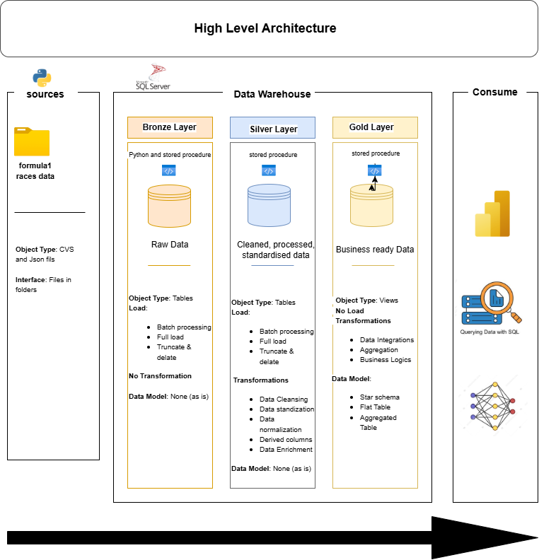

# Data Warehouse and Analytics Project

Welcome to the **Data Warehouse and Analytics Project** repository! 🚀  
This project demonstrates a comprehensive data warehousing and analytics solution, from building a data warehouse to generating actionable insights. Designed as a portfolio project, it highlights industry best practices in data engineering and analytics.

---
## 🏗️ Data Architecture

The data architecture for this project follows Medallion Architecture **Bronze**, **Silver**, and **Gold** layers:


1. **Bronze Layer**: Stores raw data as-is from the source systems. Data is ingested from CSV and Json Files into SQL Server Database.
2. **Silver Layer**: This layer includes data cleansing, standardization, and normalization processes to prepare data for analysis.
3. **Gold Layer**: Houses business-ready data modeled into a star schema required for reporting and analytics.

---
## 📖 Project Overview

This project involves:

1. **Data Architecture**: Designing a Modern Data Warehouse Using Medallion Architecture **Bronze**, **Silver**, and **Gold** layers.
2. **ETL Pipelines**: Extracting, transforming, and loading data from source systems into the warehouse.
3. **Data Modeling**: Developing fact and dimension tables optimized for analytical queries.
4. **Analytics & Reporting**: Creating SQL-based reports and dashboards for actionable insights.

🎯 This repository is an excellent resource for professionals and students looking to showcase expertise in:
- SQL Development
- Python Development
- Data Architect
- Data Engineering  
- ETL Pipeline Developer  
- Data Modeling  
- Data Analytics  

---

## 🛠️ Important Links & Tools:

Everything is for Free!
- **[Datasets](data/landing):** Access to the project dataset (csv files and Json files).
- **[SQL Server Express](https://www.microsoft.com/en-us/sql-server/sql-server-downloads):** Lightweight server for hosting your SQL database.
- **[SQL Server Management Studio (SSMS)](https://learn.microsoft.com/en-us/sql/ssms/download-sql-server-management-studio-ssms?view=sql-server-ver16):** GUI for managing and interacting with databases.
- **[Git Repository](https://github.com/):** Set up a GitHub account and repository to manage, version, and collaborate on your code efficiently.
- **[Python](https://www.python.org/downloads/):** Python is a high-level, versatile programming language used ingest files.
---

## 🚀 Project Requirements

### Building the Data Warehouse (Data Engineering)

#### Objective
Develop python data pipeline to ingest raw data from file and load to the SQL server database.
Develop a modern data warehouse using SQL Server to consolidate formula data, enabling analytical reporting and informed decision-making.

#### Specifications
- **Data Sources**: Import data from six source systems (circuits, constructors, drivers, races, results and sprints) provided as CSV files and Json files
- **Data Quality**: Cleanse and resolve data quality issues prior to analysis.
- **Integration**: Combine both sources into a single, user-friendly data model designed for analytical queries.
- **Scope**: Focus on the latest dataset only; historical data is not required.
- **Documentation**: Provide clear documentation of the data model to support both business stakeholders and analytics teams.

---

### BI: Analytics & Reporting (Data Analysis)

#### Objective
Develop SQL-based analytics to deliver detailed insights into:
- **Race results**
- **Driver rankings**
- **Constructor rankings**

These insights empower stakeholders with key metrics, enabling strategic decision-making.  


## 📂 Repository Structure
```
python-formula1-de/
│
├── data/                               # Raw datasets used for the project (formula1 data)
|   ├── bronze/                         # Scripts for extracting and loading raw data
|   ├── silver/                         # Scripts for cleaning and transforming data
|   ├── gold/                           # Scripts for creating analytical models
|   ├── docs/                               # Project documentation and architecture details
│   ├── data_architecture.drawio        # .png file shows the project's architecture
│
├── src/                                # Python scripts for ingesting data raw file
│   ├── ingestion/                      # Scripts for each file extracting and loading raw data
|
├── README.md                           # Project overview and instructions
├── LICENSE                             # License information for the repository
├── .gitignore                          # Files and directories to be ignored by Git
└── requirements.txt                    # Dependencies and requirements for the project

---

## ☕ Stay Connected

Let's stay in touch! Feel free to connect with me on the following platforms:

[](https://www.linkedin.com/in/luvo-tshaya-6800667b/)


---

## 🛡️ License

This project is licensed under the [MIT License](LICENSE). You are free to use, modify, and share this project with proper attribution.


